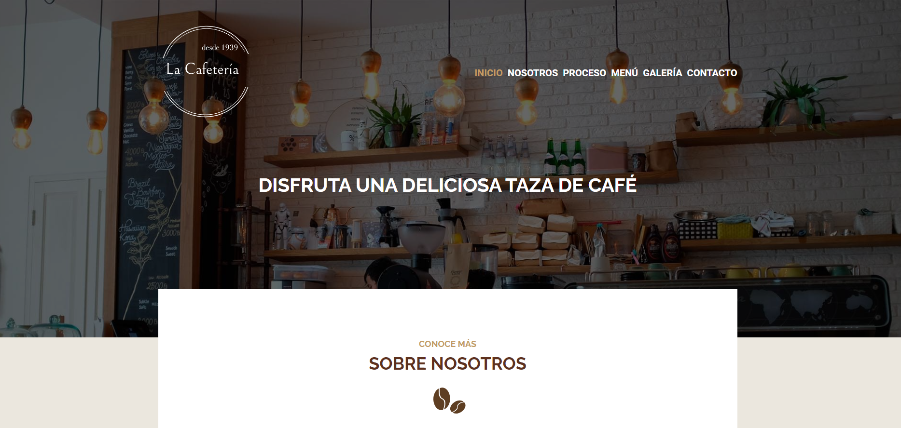

# cafeteria-sass

## Welcome to the Cafeteria App Repository!

Description:

This repository contains the code for the cafeteria webside, a website that showcases information about our cafeteria. The app is built using HTML and Sass, making it both stylish and responsive.

It uses Normalize.css, which is a small CSS file that provides better cross-browser consistency in the default styling of HTML elements. It's a modern, HTML5-ready, alternative to the traditional CSS reset.
